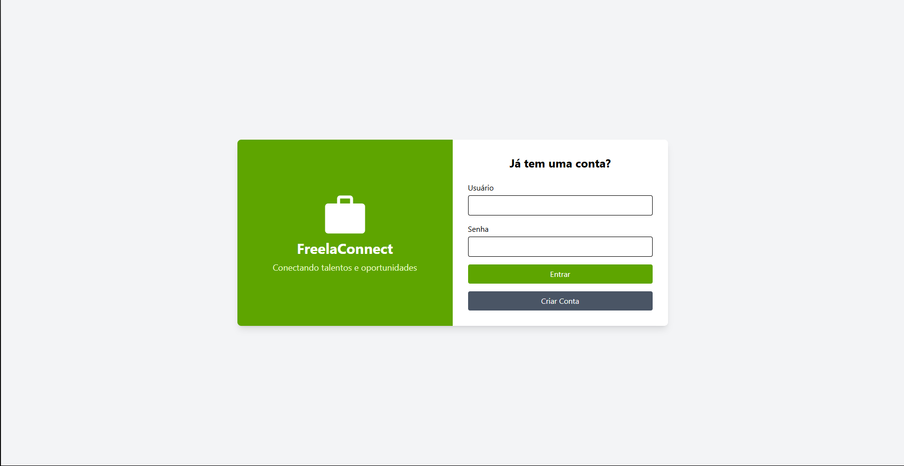
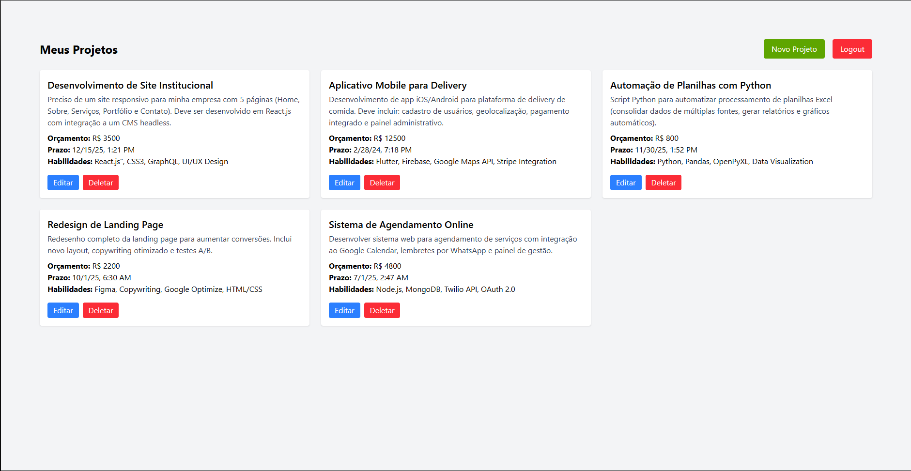

# Freelancer App 💼

Uma aplicação full stack para gerenciamento de trabalhos freelancer, onde os usuários podem se cadastrar, fazer login e gerenciar seus próprios projetos com CRUD completo.

## 🖼️ Preview




## 🚀 Funcionalidades

- Autenticação de usuários com JWT
- Cadastro e login de usuários
- Criação, edição e exclusão de projetos
- Interface intuitiva com Angular e Tailwind
- Backend seguro com .NET e controle de rotas protegidas
- Toasts de feedback com ngx-toastr

## 🛠️ Tecnologias Utilizadas

### 🔧 Frontend
- Angular 17
- Tailwind CSS
- ngx-toastr

### 🧠 Backend
- ASP.NET Core (.NET 8)
- Entity Framework Core (ORM)
- JWT (Json Web Token)

### 🗃️ Banco de Dados
- SQLite  
> 💡 Escolhido para facilitar o desenvolvimento local, evitando a necessidade de instalar servidores de banco de dados. O banco é gerado automaticamente via migrações do Entity Framework Core.

## 🎨 Protótipo
https://www.figma.com/design/0lw6MHHkGVpMFMZFQtvUYD/Prot%C3%B3tipo-SerFreelancer?node-id=0-1&t=LuIIPgYXmncCqzWV-1

## 📦 Estrutura do Projeto
freelancer-app/
- API/ # Backend .NET
- client/ # Frontend Angular
- SCRIPT SQL

## 📥 Instalação

1. **Clone o repositório**:
   ```bash
   git clone https://github.com/GustavoTT/freelancer-app.git
2. **Abra o projeto 'FREELANCER-APP no Visual Studio Code**
3. **Os comandos abaixo devem ser executados no terminal CMD do Visual Studio Code**

### Backend (.NET + SQLite)

> 💡 Certifique-se de ter o .NET 9 SDK instalado e a CLI do EF Core.
- https://dotnet.microsoft.com/pt-br/download # .NET 9.0 SDK
```bash
cd api
dotnet add package Microsoft.EntityFrameworkCore.SqlServer -v 9.0.0
```
```bash
cd api
dotnet restore
dotnet tool install --global dotnet-ef
dotnet ef database update   # Cria o banco de dados automaticamente
dotnet run
```
Acesse em: http://localhost:5104/swagger/index.html

### Frontend (Angular)

> 💡 Certifique-se de ter o Node.Js instalado e o Angular.
- https://nodejs.org/en # Node.Js
```bash
npm install -g @angular/cli # Instala o Angular
```
```bash
cd client
npm install
ng serve
```
Acesse em: http://localhost:4200

### 🔐 Rotas Protegidas
O acesso às rotas de projetos é protegido por um AuthGuard, que verifica se há um token JWT válido armazenado. Caso não haja, o usuário é redirecionado para a tela de login.

## 📝 Observações
- Dentro da API há 7 endpoints disponíveis, sendo 5 trancados com JWT, e que podem ser testadas com o Swagger UI também:
  - http://localhost:5104/swagger/index.html
- São os endpoints:
- Para Projects
    - GET -> /api/Projects          #🔐 Exibe os projetos do usuário
    - POST -> /api/Projects         #🔐 Cria um novo projeto
    - GET -> /api/Projects/{id}     #🔐 Seleciona um projeto específico
    - PUT -> /api/Projects/{id}     #🔐 Atualiza um projeto
    - DELETE -> /api/Projects/{id}  #🔐 Exclui um projeto
- Para Users
    - POST -> /api/Users            # Cadastro de usuário
    - POST -> /api/Users/login      # Autenticação de usuário
- Porém ainda existem, comentados dentro da aplicação, endpoints para excluir um usuário, ver todos os usuários e ver todos os projetos.

## 🧑‍🦰 Contato
- GitHub: GustavoTT
- Linkedin: https://www.linkedin.com/in/gustavotagli/
